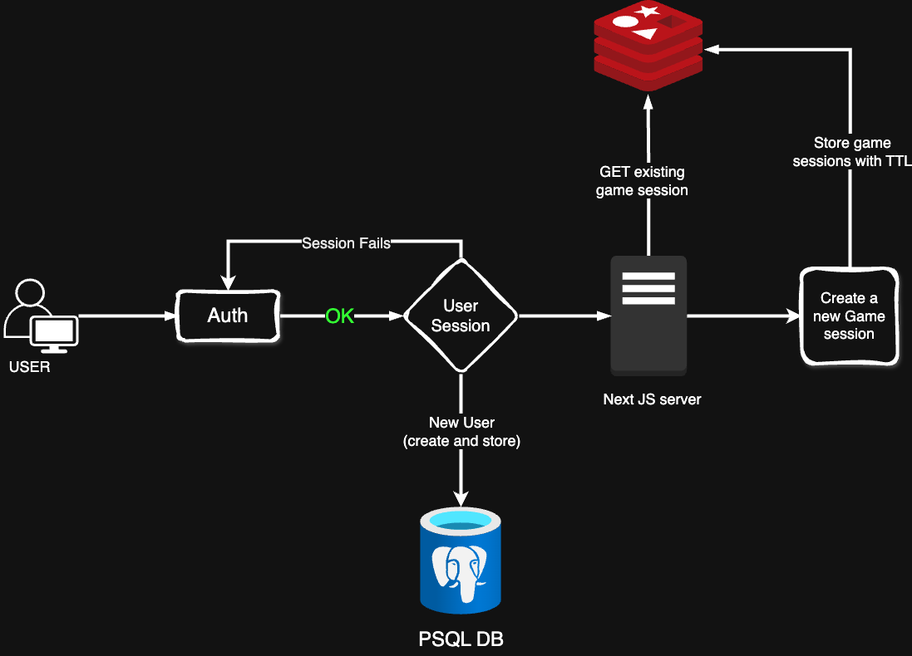

# Globetrotter Challenge

## 📚 Index

1. [Workflow / System Design](#-workflow--system-design)
2. [Tech Stack Choice](#-tech-stack-choice)
3. [Setup and Run](#-setup-and-run)
   - [Clone the Repository](#1-clone-the-repository)
   - [Install Dependencies](#2-install-dependencies)
   - [Environment Variables](#3-environment-variables)
   - [Database Setup](#4-database-setup)
   - [Run the Development Server](#5-run-the-development-server)

## 📐 Workflow / System Design



### System Overview

The **Globetrotter Challenge** is a full-stack web application designed to deliver an interactive travel guessing game. The core system is split into the following components:

1. **Frontend (Next.js)**

   - Displays random clues to the user.
   - Handles user interactions (answer selection, score updates, etc.).
   - Triggers animations and feedback for correct/incorrect answers.
   - Generates shareable links and dynamic images for the "Challenge a Friend" feature.

2. **Backend (Node.js)**

   - Manages API routes for fetching random destinations and submitting answers.
   - Stores and retrieves user profiles, scores, and session data.

3. **Database (PostgreSQL)**

   - Stores user authentication related data.
   - Records destination data, clues, and fun facts.

4. **Session Management (Redis)**

   - Ensures reliable, fast, and scalable game sessions.
   - Tracks in-progress games, storing temporary session data.

5. **Dynamic Link Generation for multi-player mode**
   - Generates custom invite links with dynamic images using a 3rd-party service or Next.js's built-in image generation capabilities.

### System Flow

1. **User Registration**

   - User registers new account or initate an OAuth session.
   - The user auth detail is registered in PostgreSQL.

2. **Game Session**

   - Backend fetches a random destination.
   - Clues are selected and presented to the user.
   - User submits an answer.

3. **Answer Validation**

   - Backend checks the answer against the correct destination.
   - Updates user's score.
   - Stores session data in Redis.

4. **Invite Flow**
   - User clicks "Challenge a Friend".
   - Generates a dynamic invite link.
   - Friend can view invitee's score and start their own session.

---

## 🚀 Tech Stack Choice

- **Frontend:** Next.js
  - SSR (Server-Side Rendering) for dynamic page generation.
  - Seamless API integration.
  - Optimized for performance.
- **Backend:** Node.js with Express
  - Fast and minimal API design.
  - Middleware flexibility.
- **Database:** PostgreSQL
  - Relational database for structured user data.
  - Ensures data integrity.
- **Session Management:** Redis
  - Fast in-memory data storage.
  - Used for managing active game sessions.
- **Authentication:** Auth.js
  - Handles user login and session tracking.

---

## 🏁 Setup and Run

### 1. Clone the Repository

```bash
git clone https://github.com/singhxayush/globetrotter-challenge.git
cd globetrotter-challenge
```

### 2. Install Dependencies

```bash
npm install
```

### 3. Environment Variables

Create a `.env` file at the root and add the following variables:

```plaintext
# PostgreSQL DB URI
DATABASE_URL=

# AUTH SECRET for JWT based auth
AUTH_SECRET=

# GITHUB OAuth secrets
GITHUB_CLIENT_ID=
GITHUB_CLIENT_SECRET=

# GOOGLE OAuth secrets
GOOGLE_CLIENT_ID=
GOOGLE_CLIENT_SECRET=

# Redis upstash
UPSTASH_REDIS_REST_URL=
UPSTASH_REDIS_REST_TOKEN=
```

### 4. Database Setup

Run the PostgreSQL migration to set up the database schema:

```bash
$ npx prisma migrate dev
```

### 5. Run the Development Server

```bash
$ npm run dev
```

Access the app at: [http://localhost:3000](http://localhost:3000) or whatever path has been provided. Default is 3000.

---

Happy globetrotting! 🌍
